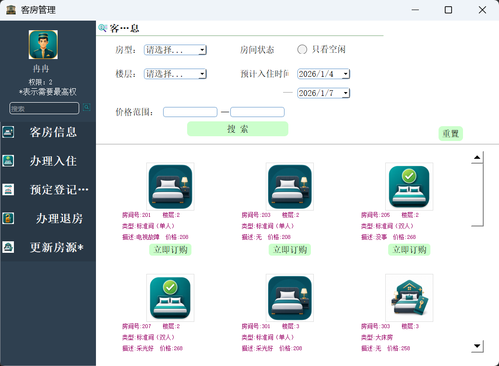

# Hotel-information-management-system
数据库课程设计——酒店信息管理系统，一人四天的工作量，使用了PyQt5、Python3.9与MySQ8.0.29

## 功能设计

目前设计了4个功能【客房管理、员工管理、报表管理、修改密码】，是一个人做课设的正常工作量

## 运行方法

1、首先配置好MySQL（需要安装与python的连接器）

[MySQL的详细安装教程 - 知乎 (zhihu.com)](https://zhuanlan.zhihu.com/p/188416607)

[pycharm连接MySQL数据库 - 晴天看恒星 - 博客园 (cnblogs.com)](https://www.cnblogs.com/korol7/p/12836290.html)

到第18步就够了，不用配置环境变量

2、安装好PyQt5

[(17条消息) Python+PyQt5+QtDesigner+PyUic+PyRcc（最全安装教程）_sever默默的博客-CSDN博客_pyrcc](https://blog.csdn.net/baidu_35145586/article/details/108110236)

[PyCharm安装PyQt5及其工具（Qt Designer、PyUIC、PyRcc）详细教程 - 知乎 (zhihu.com)](https://zhuanlan.zhihu.com/p/469526603)

[ PyQt入门教程 Qt Designer工具的使用 - 锅边糊 - 博客园 (cnblogs.com)](https://www.cnblogs.com/linyfeng/p/11223707.html)

3、在DBMS（如Navicat）或MySQL中导入`hotelManagement.sql`，即可生成需要用的所有表。导入前请先创建数据库，数据库名需要与`Main.py`中`localConfig['db']`保持一致，默认是`dbdesign`。MySQL命令行导入示例：

```bash
mysql -u root -p dbdesign < hotelManagement.sql
```

表内数据可自行修改，但是要注意外键等参照完整性约束。

4、在`Main.py`中修改`localConfig`变量里的数据库连接配置，包括`host`、`port`、`user`、`passwd`、`db`等。

5、将`pictures`文件夹放在项目根目录下。代码会自动按项目路径读取图片，例如`pictures/login4.jpg`、`pictures/search.png`等，不再需要移动到`C:`或`D:`盘。

6、运行Main.py即可

## 依赖库

* pyqt5：可视化展示
* pymysql：python3与mysql连接
* matplotlib：用于生成报表
* xlwt：用于将数据写入excel
  以上使用pip安装即可

## 截图

功能结构图：

E-R图：

客房管理界面：

## 更新记录

### v1.5 2026年更新古法系统+问题修复

* 默认演示数据更新到2026年，避免导入后数据过旧。
* 修复客房、员工、报表等窗口默认标题和图标显示问题。
* 修复客房管理默认日期无法直接筛选房源的问题。
* 修复房源图片路径依赖本机绝对路径导致图片不显示的问题。
* 优化客房管理房源卡片布局、图片比例和滚动区域显示。
